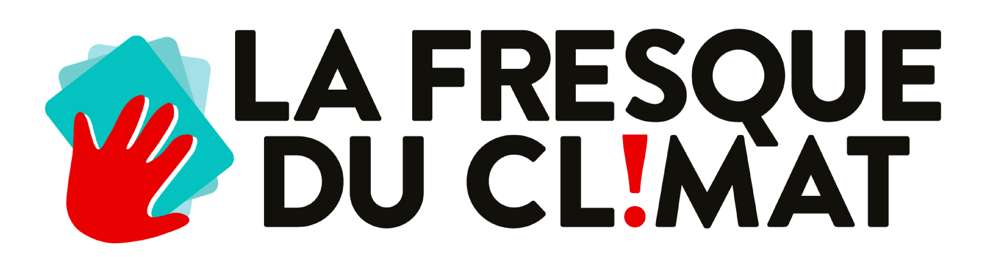
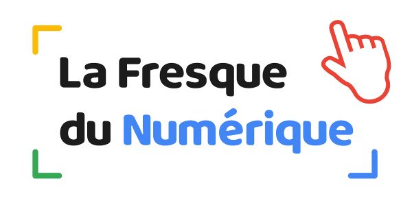
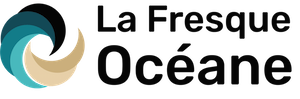
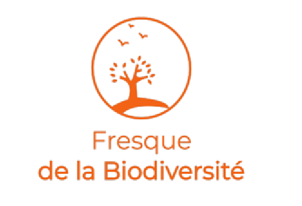
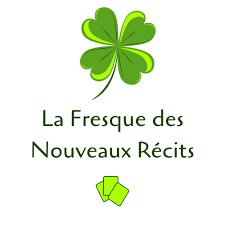
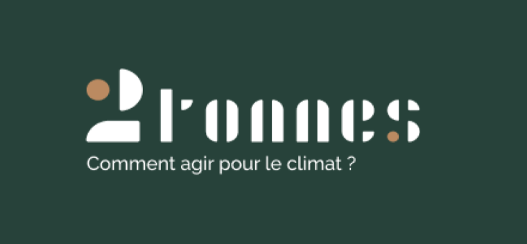
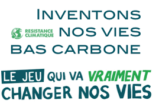
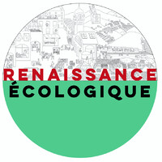
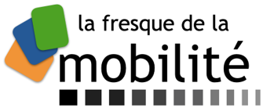

# Liste des fresques similaires à la Fresque du Climat

Après avoir constaté l’incroyable efficacité de la méthode pédagogique de la [Fresque du climat](https://fresqueduclimat.org/), certains membres de la communauté s’en sont inspirés pour développer d’autres Fresques sur des sujets transverses au **changement climatique**.

Vous retrouverez donc sur cette page un inventaire de ces fabuleux outils.  
N'hésitez pas à ouvrir à [créer une issue](https://github.com/Benbb96/liste-des-fresques/issues) ou faire une PR pour en ajouter de nouvelles !

## [La Fresque du Climat](https://fresqueduclimat.org/)

_Créée en 2015_  
La fresque est un atelier ludique, collaboratif et créatif pour sensibiliser au changement climatique, basé sur l’intelligence collective et extrêmement pédagogique.

## [La Fresque du Numérique](https://www.fresquedunumerique.org/)

_Créée en 2019_  
La Fresque du Numérique est un atelier ludique et collaboratif de 3 heures avec une pédagogie similaire à celle de La Fresque du Climat. Le but de l'atelier est de sensibiliser et former les participants aux enjeux de l'écologie dans l'univers du numérique.

## [La Fresque Océane](https://fresqueoceane.com)

_Créée en 2019_  
La Fresque Océane est un atelier collaboratif pour sensibiliser à la protection de l'Océan.  
Grâce à 100 cartes, devinez les services écosystémiques de l'Océan, plongez-vous dans la biodiversité marine, mais aussi découvrez les impact des activités humaines comme la pêche, les industries maritimes, le dérèglement climatique ou encore la pollution. Et bien sûr, échangez sur les solutions !  
Cet atelier s'adresse aux entreprises, collectivités, associations,... et à tous les citoyens qui veulent en savoir plus sur cet écosystème !

## [La Fresque de la biodiversité](https://www.linkedin.com/company/fresquedelabiodiversit%C3%A9)

_Créée en 2019_  
La Fresque de la Biodiversité est une inspiration de la Fresque du Climat adapté à la 6ème extinction de masse. Comprendre en 45 cartes la biodiversité, ses services écosystémiques, l'impact de l'espèces humaines, les 5 grandes pressions, les mécanismes d'effondrement et des pistes de solutions !

## [La Fresque des nouveaux récits](https://www.linkedin.com/company/fresque-des-nouveaux-recits/)

_Créée en 2020_  
La Fresque des Nouveaux Récits est un atelier ludique et pédagogique qui aborde le fonctionnement du cerveau et le rôle crucial des nouveaux récits.

## [Atelier 2 tonnes](https://www.linkedin.com/company/2tonnes/)

_Créé en 2020_  
C’est un atelier ludique et pédagogique pour aider et motiver au passage à l’action pour le climat !  
Grâce à une plateforme web, il permet de se projeter de façon personnalisée (les participants réalisent leur empreinte carbone avant l'atelier et travaillent sur leurs propres données) et d'avoir une approche systémique en incarnant les décideurs nationaux publics et privés, pour arbitrer entre différentes mesures impactant l'ensemble du pays. Le tout sur un ton léger et décomplexé (durant l'atelier, on peut rencontrer Donald Trump, incarner un ministre... ou un dictateur!).

## [Inventons nos vies bas carbone](https://www.resistanceclimatique.org/inventons_nos_vies_bas_carbone)

_Créé en 2019_  
Ce kit donne à voir les ordres de grandeur (hauteur de la marche) de la transition à opérer : 12 t CO2e => <2 t CO2e, visualiser des tonnes de CO2e avec des cartes simples et efficaces : rouler, voler, manger de la viande, consommer, chauffer un logement, etc.) et tout ce qu'on va pouvoir faire en plus dans une vie bas carbone. Il y a deux lots de cartes : constats pour comprendre comment la physique du climat nous engage (budget carbone...) et solutions pour voir ce qu'on peut et ce qu'on doit changer pour les engagements pris dans l'accord de Paris, traduits dans la loi (SNBC).

## [La Fresque de la Renaissance Écologique](https://www.renaissanceecologique.fr/)

_Créée en 2014_  
A quoi ressemble un monde qui a réussi sa transition écologique et comment pourrions-nous y parvenir ? La fresque de la Renaissance Écologique consiste à construire en intelligence collective des projets pour mener une organisation vers la transition écologique, en s'appuyant sur une adaptation contemporaine de la fresque de Lorenzetti Allégorie et effets du Bon Gouvernement : un dessin en noir et blanc qui représente un monde bas carbone, la ville et la campagne. L’atelier s’adapte à des thématiques particulières, des cibles variées et ouvre le champ des possibles.

## [La Fresque de la mobilité](https://fresquedelamobilite.org/)

_Créée en 2019_  
Cet atelier est un outil de sensibilisation et de formation aux enjeux et aux solutions de décarbonation de la mobilité des personnes. Il s'adresse au grand public, mais aussi aux entreprises et aux collectivités.

## [Mes Solutions Climat](https://www.littlebigimpact.com/mes-solutions-climat/)

_Créée en 2020_  
“Mes Solutions Climat” est un atelier collectif ludique de 2h pour déterminer les écogestes à lancer à votre niveau afin de réduire votre impact carbone et préserver les ressources naturelles. Il peut être utilisé en support de la FdC pour un débrief orienté action.

## [La Fresque des Déchets](https://greendonut.org/)

_Créée en 2020_  
"La Fresque des Déchets" est un atelier basé sur l'intelligence collective et la coopération invitant les participants à schématiser le devenir de leurs déchets et à approfondir les impacts de leurs habitudes de consommation. Il permet de prendre conscience de notre consommation de ressources au quotidien au travers le prisme des déchets tout en sensibilisant sur les bonnes pratiques de tri et surtout de prévention.

## [La Fresque de l'Alimentation](http://fresquealimentation.org/)

_Créée en 2020_  
Comprendre les grandes lignes de notre alimentation et les impacts environnementaux, sanitaires et sociaux qu'elle engendre.  
Puis définir ce qu'est une alimentation durable (végétalisée, locale et en agriculture bio).  
Comprendre en quoi une alimentation durable améliore la résilience alimentaire.
