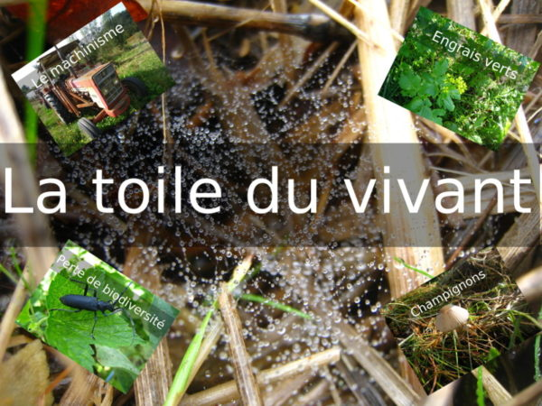
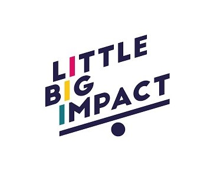
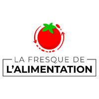
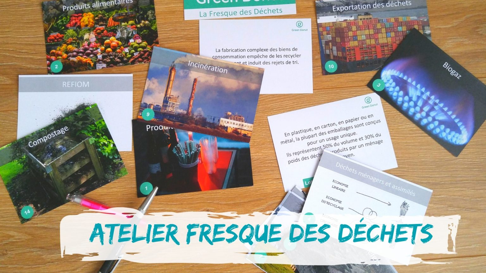
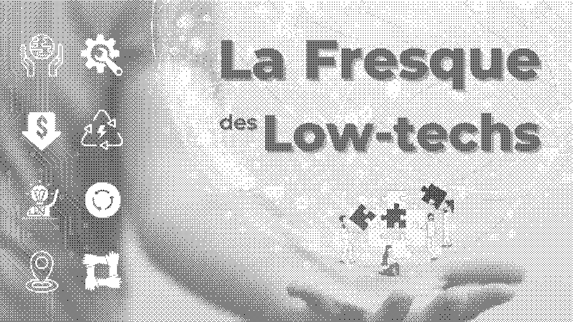
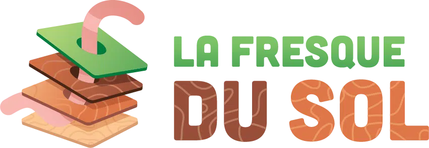

# Liste des fresques similaires à la Fresque du Climat

Après avoir constaté l’incroyable efficacité de la méthode pédagogique de la [Fresque du climat](https://fresqueduclimat.org/), certains membres de la communauté s’en sont inspirés pour développer d’autres Fresques sur des sujets transverses au **changement climatique**.

Vous retrouverez donc ici un inventaire non exhaustif de ces fabuleux outils que j'ai compilé à l'aide de ce [tableur](https://docs.google.com/spreadsheets/d/1q_9L9U8Gn6qX7Wgcu7sAwo9fnUcbeSGHJGYqm_1nHs0/edit?usp=sharing).  
N'hésitez pas à [ouvrir une issue](https://github.com/Benbb96/liste-des-fresques/issues/new) ou à faire une Pull Request ([tuto en anglais](https://docs.github.com/en/pull-requests/collaborating-with-pull-requests/proposing-changes-to-your-work-with-pull-requests/creating-a-pull-request-from-a-fork)) pour en ajouter de nouvelles !

## [La Fresque du Climat](https://fresqueduclimat.org/)

_Créée en 2015_  
La fresque est un atelier ludique, collaboratif et créatif pour sensibiliser au changement climatique, basé sur l’intelligence collective et extrêmement pédagogique.

## [La Fresque du Numérique](https://www.fresquedunumerique.org/)

_Créée en 2019_  
La Fresque du Numérique est un atelier ludique et collaboratif de 3 heures avec une pédagogie similaire à celle de La Fresque du Climat. Le but de l'atelier est de sensibiliser et former les participants aux enjeux de l'écologie dans l'univers du numérique.

## [La Fresque Océane](https://fresqueoceane.com)

_Créée en 2019_  
La Fresque Océane est un atelier collaboratif pour sensibiliser à la protection de l'Océan.  
Grâce à 100 cartes, devinez les services écosystémiques de l'Océan, plongez-vous dans la biodiversité marine, mais aussi découvrez les impact des activités humaines comme la pêche, les industries maritimes, le dérèglement climatique ou encore la pollution. Et bien sûr, échangez sur les solutions !  
Cet atelier s'adresse aux entreprises, collectivités, associations,... et à tous les citoyens qui veulent en savoir plus sur cet écosystème !

## [La Fresque de la Biodiversité](https://www.linkedin.com/company/fresquedelabiodiversit%C3%A9)

_Créée en 2019_  
La Fresque de la Biodiversité est une inspiration de la Fresque du Climat adapté à la 6ème extinction de masse. Comprendre en 45 cartes la biodiversité, ses services écosystémiques, l'impact de l'espèces humaines, les 5 grandes pressions, les mécanismes d'effondrement et des pistes de solutions !

## [La Fresque des Nouveaux Récits](https://www.linkedin.com/company/fresque-des-nouveaux-recits/)

_Créée en 2020_  
La Fresque des Nouveaux Récits est un atelier ludique et pédagogique qui aborde le fonctionnement du cerveau et le rôle crucial des nouveaux récits en :

1. Étudiant les verrous sociaux-cognitifs à la nécessaire transition ("_le savoir c'est le pouvoir_" - Francis Bacon)
2. Se reliant collectivement à notre pouvoir créateur
3. Partageant les nouveaux récits à travers le monde

## [Atelier 2 tonnes](https://www.linkedin.com/company/2tonnes/)

_Créé en 2020_  
C’est un atelier ludique et pédagogique pour aider et motiver au passage à l’action pour le climat !  
Grâce à une plateforme web, il permet de se projeter de façon personnalisée (les participants réalisent leur empreinte carbone avant l'atelier et travaillent sur leurs propres données) et d'avoir une approche systémique en incarnant les décideurs nationaux publics et privés, pour arbitrer entre différentes mesures impactant l'ensemble du pays. Le tout sur un ton léger et décomplexé (durant l'atelier, on peut rencontrer Donald Trump, incarner un ministre... ou un dictateur!).

## [Inventons nos vies bas carbone](https://www.resistanceclimatique.org/inventons_nos_vies_bas_carbone)

_Créé en 2019_  
Ce kit donne à voir les ordres de grandeur (hauteur de la marche) de la transition à opérer : 12 t CO2e => <2 t CO2e, visualiser des tonnes de CO2e avec des cartes simples et efficaces : rouler, voler, manger de la viande, consommer, chauffer un logement, etc.) et tout ce qu'on va pouvoir faire en plus dans une vie bas carbone. Il y a deux lots de cartes : constats pour comprendre comment la physique du climat nous engage (budget carbone...) et solutions pour voir ce qu'on peut et ce qu'on doit changer pour les engagements pris dans l'accord de Paris, traduits dans la loi (SNBC).

## [La Fresque de la Renaissance Écologique](https://www.renaissanceecologique.fr/)

_Créée en 2014_  
A quoi ressemble un monde qui a réussi sa transition écologique et comment pourrions-nous y parvenir ? La fresque de la Renaissance Écologique consiste à construire en intelligence collective des projets pour mener une organisation vers la transition écologique, en s'appuyant sur une adaptation contemporaine de la fresque de Lorenzetti Allégorie et effets du Bon Gouvernement : un dessin en noir et blanc qui représente un monde bas carbone, la ville et la campagne. L’atelier s’adapte à des thématiques particulières, des cibles variées et ouvre le champ des possibles.

## [La Toile du Vivant](http://www.territoires-vivants.fr/la-toile-du-vivant/)

_Créée en 2018_  
La toile du vivant est un outil pédagogique de sensibilisation aux enjeux de l’agroécologie développé par Arnaud Meillarec. Il permet d’appréhender et de s’approprier efficacement les notions complexes liées aux mécanismes du vivant en jeu en agriculture. Toute l’équipe est impliquée dans la résolution d’une problématique commune, où chaque individu peut apporter ses propres connaissances et les confronter à ses coéquipiers.

## [La Fresque de la Mobilité](https://fresquedelamobilite.org/)

_Créée en 2019_  
Cet atelier est un outil de sensibilisation et de formation aux enjeux et aux solutions de décarbonation de la mobilité des personnes. Il s'adresse au grand public, mais aussi aux entreprises et aux collectivités.

## [Little Big Impact](https://www.littlebigimpact.com/)

_Créée en 2020_  
Anciennement “Mes Solutions Climat”, l'éco challenge Little Big Impact est un atelier collectif ludique de 2h pour déterminer les écogestes à lancer à votre niveau afin de réduire votre impact carbone et préserver les ressources naturelles. Il peut être utilisé en support de la FdC pour un débrief orienté action.

## [La Fresque de l'Alimentation](http://fresquealimentation.org/)

_Créée en 2020_  
Comprendre les grandes lignes de notre alimentation et les impacts environnementaux, sanitaires et sociaux qu'elle engendre.  
Puis définir ce qu'est une alimentation durable (végétalisée, locale et en agriculture bio).  
Comprendre en quoi une alimentation durable améliore la résilience alimentaire.

## [La Fresque des Déchets](https://greendonut.org/dechets/)

_Créée en 2020_  
"La Fresque des Déchets" est un atelier basé sur l'intelligence collective et la coopération invitant les participants à schématiser le devenir de leurs déchets et à approfondir les impacts de leurs habitudes de consommation. Il permet de prendre conscience de notre consommation de ressources au quotidien au travers le prisme des déchets tout en sensibilisant sur les bonnes pratiques de tri et surtout de prévention.

## [La Fresque du Textile](https://greendonut.org/textile/)

_Créée en 2020_  
Par le même créateur que la Fresque des Déchets (l'association Green Donut), la Fresque du textile se focalise sur l'industrie du textile, de la production à la fin de vie en passant par le cycle d'usage. Il permet de prendre conscience des impacts environnementaux et sociaux de ce secteur tout en sensibilisant sur les bonnes pratiques de choix et d'utilisation du textile.

## [La Fresque des Low-Techs](https://fresquedeslowtechs.org/)

_Créée en 2021_  
(non)soutenabillité des technologies au point de vue environnemental et social, d'un point de vue économique et général, et solution low-tech.

## [La Fresque du sol](https://fresquedusol.com/)

_Créée en 2022_  
La fresque du sol est un outil ludique et collaboratif qui vise à diffuser un langage commun sur le fonctionnement des sols, et sur les enjeux liés à leur préservation.  
Au travers de 50 cartes et en 3h, permet de comprendre ce qu’est un sol, comment celui-ci se forme et quelles fonctions écologiques découlent de ses propriétés pour ensuite découvrir l’ensemble des services que l’on en retire, les menaces qui rendent ces services limités dans le temps et l’espace et les actions que l’on peut engager pour préserver le fonctionnement des sols…

## [La Fresque du Bénévolat](https://www.jeveuxaider.gouv.fr/fresque-benevolat)

_Créée en 2023_ 
La Fresque du Bénévolat est un atelier participatif et ludique, conçu pour faciliter le passage à l’action bénévole. 
Pendant 2h30, des groupes de 8 à 15 participants suivent un parcours sur le thème de la randonnée, alliant intelligence collective et introspection. Ensemble, ils avancent à travers trois étapes : comprendre et définir le bénévolat, identifier ses propres freins et ses motivations, puis découvrir les leviers et outils concrets pour passer à l’action.
À l’issue de l’atelier, chaque participant repart avec un "guide de rando" pratique pour faciliter son premier pas vers le bénévolat. Un site web dédié, “La Fresque du Bénévolat,” permet de trouver une fresque près de chez soi, d’accéder aux ressources et de mesurer l'impact de l'atelier sur l’engagement des participants.
La fresque du bénévolat a été créée par la start-up d’Etat JeVeuxAider.gouv.fr, au sein de la DJEPVA (Direction de la jeunesse, de l'éducation populaire et de la vie associative).…

# Ressources
- [Document Google Sheet](https://docs.google.com/spreadsheets/d/1q_9L9U8Gn6qX7Wgcu7sAwo9fnUcbeSGHJGYqm_1nHs0/edit?usp=sharing) tenu à jour par la communauté (avec celles qui sont encore en construction)
- [Page wiki référençant les fresques amies](https://wiki.climatefresk.org/?title=Les_fresques_amies)
- [Une fresque des fresques !](https://view.genial.ly/6087d1e2b7f1070d38edd485/interactive-content-les-fresques-amies-version-logo)
- [Outil Open Source](https://github.com/trouver-une-fresque/trouver-une-fresque) pour détecter les ateliers disponibles dans votre département
